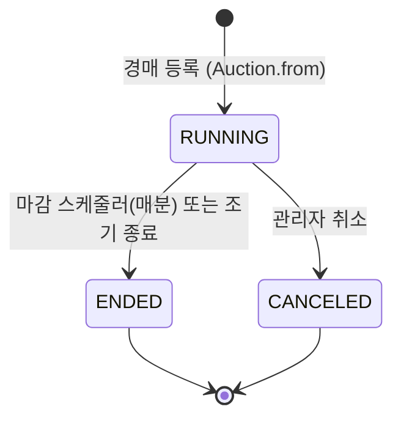
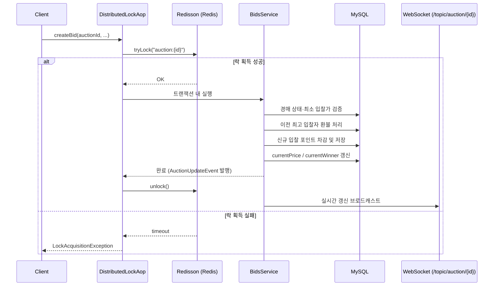
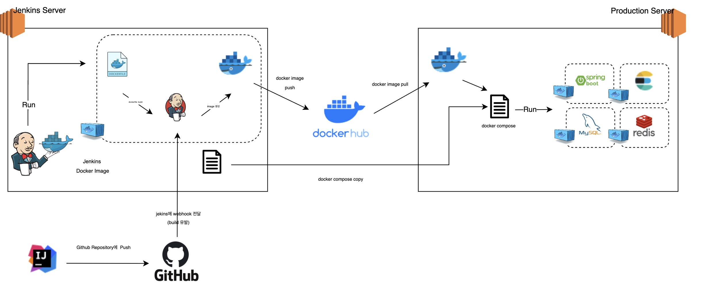

<a id="readme-top"></a>

# ddip

경매(Auction)와 크라우드펀딩(공동구매/Project)을 결합한 커머스 플랫폼입니다.


<details>
<summary>목차</summary>

- [담당 영역](#담당-영역)
- [기술 스택](#기술-스택)
- [아키텍처 개요](#아키텍처-개요)
- [1. 경매(Auction) 도메인](#1-경매auction-도메인)
- [2. 분산락 (Redisson)](#2-분산락-redisson)
- [3. Elasticsearch](#3-elasticsearch)
- [4. CI/CD 파이프라인](#4-cicd-파이프라인)

</details>

## 담당 영역

| 영역 | 내용 |
|---|---|
| 경매(Auction) 도메인 | 입찰, 낙찰, 상태 전이 전체 로직 |
| 동시성 제어 | Redisson 기반 분산락으로 동시 입찰 경합 제어 |
| 검색 | Elasticsearch + Nori 형태소 분석기 세팅 |
| 배포 | Jenkins CI/CD 파이프라인 및 서버 배포 구조 |

## 기술 스택

| 구분 | 기술 |
|---|---|
| 프레임 워크 | Java, Spring Boot |
| DB | MySQL, Spring Data JPA, QueryDSL 5.1.0 |
| 검색 | Elasticsearch |
| 동시성 제어 | Redisson |
| 실시간 통신 | WebSocket |
| 인증 | Spring Security, OAuth2 Client, JWT |
| 인프라 | AWS S3, AWS EC2 |
| 외부 연동 | SOLAPI (SMS) |
| CI/CD | Jenkins, Docker, Docker Compose |

<p align="right"><a href="#readme-top">맨 위로</a></p>

## 아키텍처 개요

**패키지 구조** (`backend/src/main/java/com/ddip/backend`)

| 패키지 | 역할 |
|---|---|
| `auction` | 경매 도메인 — 입찰/낙찰/상태 전이 |
| `project` | 크라우드펀딩(공동구매) 도메인 |
| `pledge` | 공동구매 참여(펀딩) |
| `billing` | 포인트/결제 |
| `user` | 회원/인증 |
| `notification` | 알림 |
| `recommendation` | 추천 |
| `admin` | 관리자 기능 |
| `common` | 공통 설정, AOP, 이벤트 핸들러 |

<p align="right"><a href="#readme-top">맨 위로</a></p>

---

## 1. 경매(Auction) 도메인

`Auction` 엔티티가 판매자(`seller`)/현재 최고가 입찰자(`currentWinner`)/최종 낙찰자(`winner`)를 구분해서 들고 있고, `AuctionStatus`(`RUNNING`/`ENDED`/`CANCELED`)로 진행 상태를 관리합니다.



| 메서드 | 역할 |
|---|---|
| `Auction.from(User, AuctionRequestDto)` | 경매 등록, 초기 상태 `RUNNING` |
| `updateCurrentPrice` | 새 입찰 발생 시 현재가 갱신 |
| `updateCurrentWinner` | 새 입찰 발생 시 최고 입찰자 갱신 |
| `updateWinner` | 마감 시 최종 낙찰자 확정 |
| `updateAuctionStatus` | `RUNNING → ENDED/CANCELED` 상태 전이 |

입찰 처리(`BidsService.createBid`) 후에는 `AuctionUpdateEvent`/`AuctionEsEvent`를 발행하고, `AfterCommitEventHandler`가 커밋 이후(`AFTER_COMMIT`) 시점에 Elasticsearch 색인 동기화와 `/topic/auction/{id}` 브로드캐스트를 함께 처리합니다.

<p align="right"><a href="#readme-top">맨 위로</a></p>

## 2. 분산락 (Redisson)

여러 사용자가 동시에 같은 경매에 입찰할 때 발생하는 레이스 컨디션을 막기 위해, AOP 기반 Redisson으로 분산락을 구현해보았습니다.

```java
@DistributedLock(key = "'auction:' + #auctionId")
public void createBid(Long auctionId, ...) { ... }
```

- `@DistributedLock` — 락 이름(SpEL로 동적 파라미터 지정), 대기시간(`waitTime`), 임대시간(`leaseTime`)을 선언적으로 지정
- `DistributedLockAop` — `RedissonClient`로 `RLock`을 얻어 `tryLock` → 트랜잭션 실행(`AopForTransaction`) → `unlock`까지 처리하는 AOP
- 락 획득 실패/인터럽트는 각각 `LockAcquisitionException`/`LockInterruptedException`으로 매핑

`BidsService.createBid`에 적용되어, 같은 경매(`auctionId`)에 대한 입찰 요청은 한 번에 하나씩만 처리되도록 보장합니다.



<p align="right"><a href="#readme-top">맨 위로</a></p>

## 3. Elasticsearch

경매/공동구매 제목·설명 검색에 한글 형태소 분석기(Nori)를 적용했습니다.

| 구성 요소 | 역할 |
|---|---|
| `custom-nori-analyzer` | `nori_tokenizer` 기반, 형태소 단위 검색 |
| `custom-ngram-analyzer` | n-gram 기반, 부분 문자열 검색 보완 |
| `AuctionDocument` / `ProjectDocument` | `@Setting`/`@Mapping`으로 위 분석기를 적용한 인덱스 매핑 |
| `AuctionSearchService` / `ProjectSearchService` / `BuildSearchQueryUtil` | 키워드 검색 + 날짜 필터 결합 쿼리 구성 |

정의 파일: `elasticsearch/tokenizer-setting.json`

<p align="right"><a href="#readme-top">맨 위로</a></p>

---

## 4. CI/CD 파이프라인



Jenkins 기반으로 GitHub push → 빌드 → 배포까지 자동화된 파이프라인을 직접 구성했습니다.

**흐름**

1. **Push** — IntelliJ에서 작성한 코드를 GitHub 저장소에 push
2. **Webhook** — GitHub가 Jenkins에 webhook을 전달해 빌드를 트리거
3. **Build (Jenkins Server)**
   - Jenkins가 Docker 컨테이너로 실행되며(Jenkins Docker Image), `Dockerfile`을 기반으로 백엔드/Elasticsearch 이미지를 빌드
   - 빌드된 이미지를 Docker Hub로 push
4. **Deploy (Production Server)**
   - Production 서버가 Docker Hub에서 최신 이미지를 pull
   - Jenkins 서버가 `docker-compose.yml`을 Production 서버로 복사(scp)
   - `docker compose`로 Spring Boot / Elasticsearch / MySQL / Redis 컨테이너를 기동

**Jenkinsfile 단계**

| Stage | 내용 |
|---|---|
| Checkout | GitHub 저장소 체크아웃 |
| Docker Login | Docker Hub 로그인 (Credential 사용) |
| Build & Push | 백엔드/Elasticsearch 이미지 빌드 후 Docker Hub push |
| Deploy | `docker-compose.yml`을 배포 서버로 scp, SSH로 배포 스크립트 실행 |
| Cleanup | 로그아웃 및 빌드 캐시/이미지 정리 |

배포 대상 인프라: AWS EC2, MySQL / Redis / Elasticsearch 컨테이너, 도메인 `ddip.store`

<p align="right"><a href="#readme-top">맨 위로</a></p>